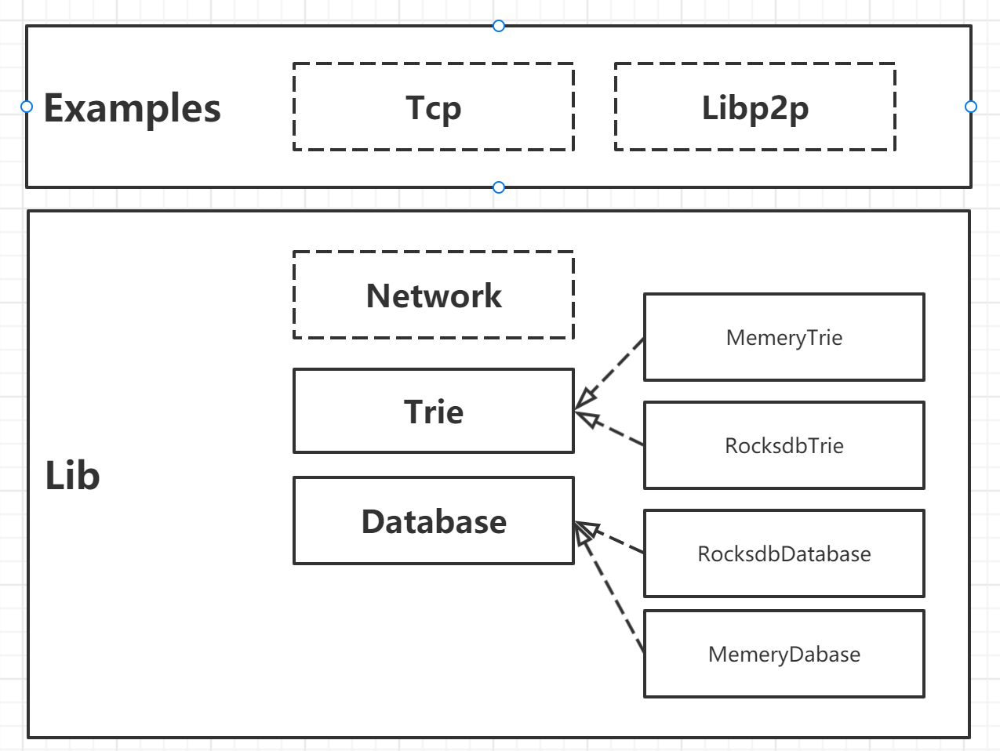

# tinympt

[Substrate入门课](https://appbhteffsi3308.h5.xiaoeknow.com/p/course/video/v_63f32e14e4b0fc5d1234c8bd?product_id=p_638027c6e4b0fc5d1209ecac) Office Hour 演示项目。

## 项目介绍

本项目旨在介绍 Merkle Patrica Trie 基本原理，并演示如何实现获得`Proof`证明和如何验证`Proof`。

## 参考的资料

[Kaichao 老师的博文：理解 Substrate 数据存储的底层实现 Merkle Patricia Trie](https://zhuanlan.zhihu.com/p/113755342)

[https://github.com/M4tsuri/mpt-rs](https://github.com/M4tsuri/mpt-rs)

## 实现的功能：
- Merkle Patricia Tree数据结构定义
- Persistent Trie的插入（insert），查询（get）和回退（revert）
- Merkle Proof构造与验证
- 网络：实现了`tcp`和`libp2p`两种协议。
- 实现了`内存`和`Rocksdb`两种存储。全节点使用`Rocksdb`存储，轻节点使用`内存`存储。

## 未实现的功能：
- 未实现缓存功能。
- 未实现按前缀查询数据集合的功能。

有兴趣的同学可尝试实现这两个功能。

## 架构



## 代码结构

```sh
src
├── database               # 程序入口
│   ├── memory.rs          # 内存数据库
│   ├── mod.rs             # Database trait 定义
│   ├── rocksdb.rs         # Rocksdb 数据库
├── network                # 网络相关
│   ├── pb                 # protobuf 相关
│   │   ├── abi.rs         # protobuf 生成的代码
│   │   └── mod.rs         # 对 protobuf 生成的代码定义了实用方法
│   ├── abi.proto          # protobuf 定义文件，定义了 proof 请求和响应消息
│   └── mod.rs             # network 模块入口
├── trie                   # trie 模块
│   ├── node               # trie 内部的节点
│   │   ├── branch.rs      # 分支节点
│   │   ├── extension.rs   # 扩展节点
│   │   ├── mod.rs         # node 模块入口
│   │   └── node.rs        # 叶子节点
│   ├── memory_trie.rs     # 使用了内存数据库的 trie 实现
│   ├── rocksdb_trie.rs    # 使用了 rocksdb 数据库的 trie 实现
│   ├── mod.rs             # trie 模块入口, 
│   └── util.rs            # 工具方法
├── error.rs               # 错误类型
└── lib                    # 库的入口
```

## 运行示例

### Tcp 示例

启动服务端
```sh
cargo run --example tcp_server --features="network rocksdb" -- --server-addr=127.0.0.1:9988 --db-path=/tmp/tinympt_db
```
控制台打印如下信息，表明 tcp_server 启动成功。
```sh
[2023-03-12T12:18:46Z INFO  tcp_server] Root hash = "1b18217ad8a87e1accfdf7b3b1c4573985c932b711d6494db246e59fb884e952" #在客户端启动是这个 root hash 要用到
[2023-03-12T12:18:46Z INFO  tcp_server] Listening on 127.0.0.1:9988
```

启动客户端
```sh
cargo run --example tcp_client --features="network rocksdb" -- --server-addr=127.0.0.1:9988 --root-hash=1b18217ad8a87e1accfdf7b3b1c4573985c932b711d6494db246e59fb884e952 --key=pellet02_state01_key02
```
控制台打印如下信息，表明 proof 验证成功。
```sh
[2023-03-12T12:23:53Z INFO  tcp_client] Proof response, exists = true
[2023-03-12T12:23:53Z INFO  tcp_client] Value = Some("pellet02_state01_value02")
```

### Libp2p 示例

启动节点一
```sh
cargo run --example libp2p_node --features="network rocksdb" -- --db-path=/tmp/tinympt_db_01 --root-hash=1b18217ad8a87e1accfdf7b3b1c4573985c932b711d6494db246e59fb884e952 --key=pellet02_state01_key02
```
控制台打印如下信息，表明结节一启动成功。
```sh
[2023-03-12T12:28:34Z INFO  libp2p_node] Root hash = "1b18217ad8a87e1accfdf7b3b1c4573985c932b711d6494db246e59fb884e952"
[2023-03-12T12:28:34Z INFO  libp2p_mdns::behaviour::iface] creating instance on iface 172.25.154.157
[2023-03-12T12:28:34Z INFO  libp2p_node] Listening on "/ip4/127.0.0.1/tcp/34427" # 这个地址在节点二启动时可能要用到
[2023-03-12T12:28:34Z INFO  libp2p_node] Listening on "/ip4/172.25.154.157/tcp/34427" # 这个地址在节点二启动时可能要用到
```

启动节点二

提示：如果节点二与节点一在同一个局域网，且局域网支持 mdns，--to-dial 参数可以不写。
```sh
cargo run --example libp2p_node --features="network rocksdb" -- --db-path=/tmp/tinympt_db_02 --root-hash=1b18217ad8a87e1accfdf7b3b1c4573985c932b711d6494db246e59fb884e952 --key=pellet02_state01_key02 --to-dial=/ip4/127.0.0.1/tcp/34427 # --to-dial 是节点一的地址
```
控制台打印如下信息，表明 proof 验证成功。
```sh
[2023-03-12T12:36:16Z INFO  libp2p_node] Proof response, exists = true
[2023-03-12T12:36:16Z INFO  libp2p_node] Value = Some("pellet02_state01_value02")
```


